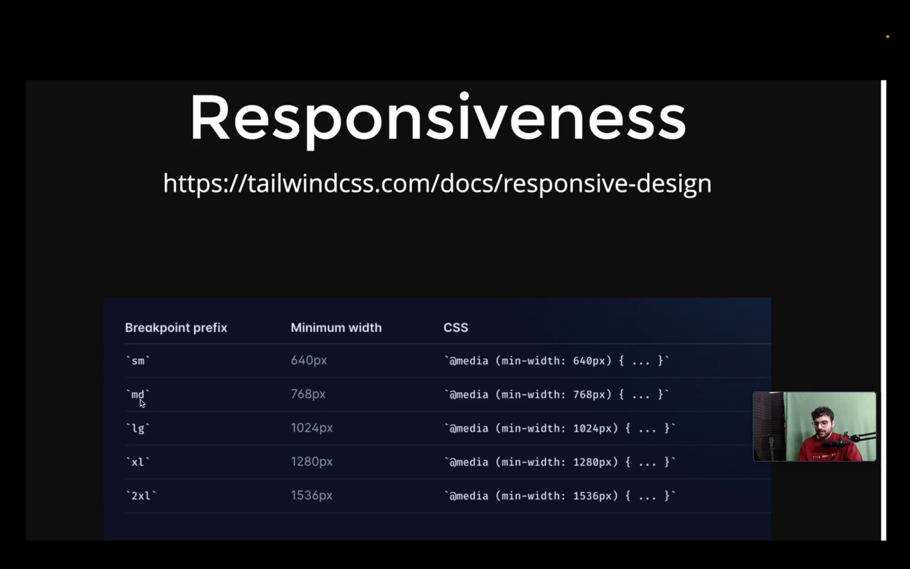

There are 4 things to learn in a frontend framework.  
1. Flex
2. Grid
3. Responsiveness
4. background color, text color, hover.

# FLEX =: 
flex let you postition element or divs  to each other most specifically 

Tailwind is not a eact specific library so you need to install it with the commad npm install tailwind.
1. You need to install the tailwind from thje version of 3.9 or below cause that's ther version which supports the vite react project.
2. Need to install the tailwind with this cmd npm install -D tailwindcss@3 postcss autoprefixer
npx tailwindcss init -p
3.   content: [
    "./index.html",
    "./src/**/*.{js,ts,jsx,tsx}",
  ],
   paste this im the tailwind.config.js
4. @tailwind base;
@tailwind components;
@tailwind utilities;
paste this in the index.css file.

# Grids :-
Grids means the width of your application 

# Responsiveness :-
They are like the breakpoints in your screen..
Tailwind is  the mobile first screen cause by default tailwind uses mobile-first breakdown system. What this means is that if you have unprefixed utilities take effect on the all screen sizes and if you have the prefixed utilities they will only take the specific breakpoint or above.

* https://projects.100xdevs.com/tracks/oAjvkeRNZThPMxZf4aX5/QDisg3v6Fo9r08H6NsSd 
We will be building a paytm from the start to end with the frontend and backend.